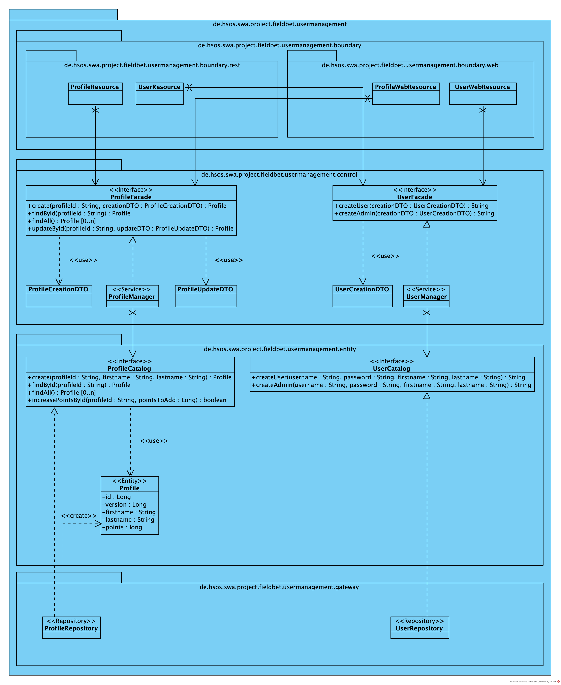
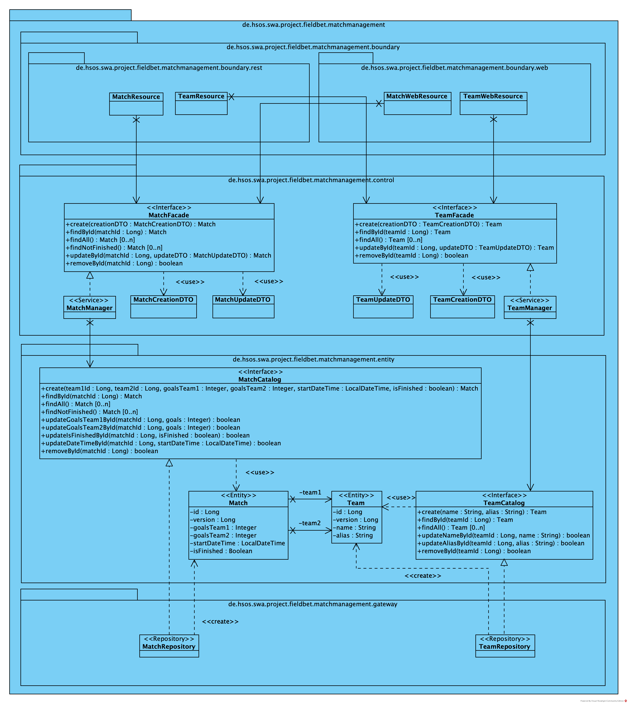
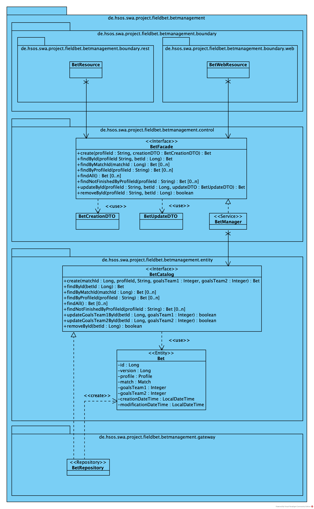
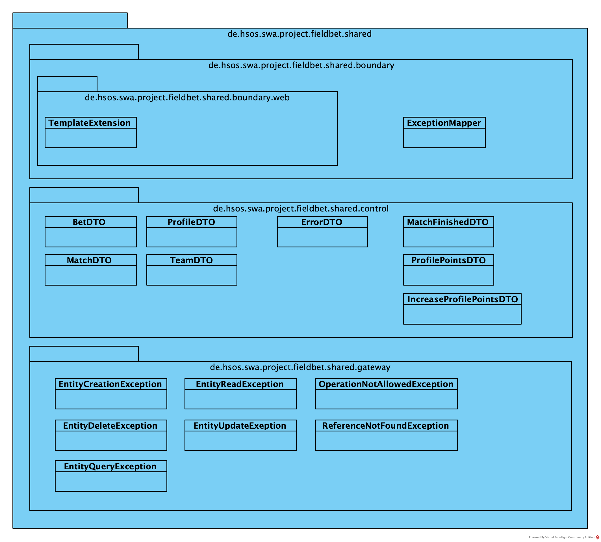

# SWA Projekt - FieldBet

# Entwicklung einer Web-Anwendung mit Java, Jakarta EE und Quarkus

#### Patrick Felschen | Julian Voß

#

In dieser Ausarbeitung wird die Planung und Implementation einer Web-Applikation unter Nutzung von Jakarta Enterprise Edition (EE) und Quarkus dargestellt.

Die umgesetzte Anwendung stellt ein Tippspiel für Fußballspiele dar. Nutzern ist es möglich, nach einer Registrierung Wetten auf angebotene Spiele abzugeben.

Ein Administrator ist dafür zuständig, anstehende Spiele in das System einzutragen, sowie abgeschlossene Spiele mit dem entsprechenden Ergebnis zu aktualisieren.

Wurde ein Spiel beendet, nimmt das System eine automatische Punkteverteilung vor, die Punkte werden anhand der Genauigkeit des Tipps vergeben. Das System kann über eine Web-App und eine REST-Schnittstelle bedient werden

## Bauen der Anwendung

```shell script
./mvnw compile
```

## Ausführen der Anwendung (dev mode)

```shell script
./mvnw quarkus:dev
```

> **_INFO:_** Docker-Umgebung muss vorhanden sein.

## Testen der Anwendung

```shell script
./mvnw test
```

> **_INFO:_** Docker-Umgebung muss vorhanden sein.

## Benutzer

| #   | username | password | role  |
| --- | -------- | -------- | ----- |
| 1   | pfelsche | pfelsche | admin |
| 2   | juliavos | juliavos | admin |
| 3   | user     | user     | user  |

#

### SWAGGER UI:

http://localhost:8080/q/swagger-ui

### REST-Resourcen:

http://localhost:8080/api/v1/

### WEB-Anwendung:

http://localhost:8080/web/v1/bets


### Keycloak

http://localhost:8180/

### Metriken

http://localhost:8080/q/metrics

### Test

Um die REST-Schnittstelle zu testen, kann das folgende Insomnia Projekt importiert werden:

[Insomnia Projekt Export](dokumente/Insomnia_SWA_Projekt_FielBet_v1_Export.json)

# Struktur der Anwendung

## User Management



## Match Management



## Bet Management



## Shared



# Struktur der Datenbank


